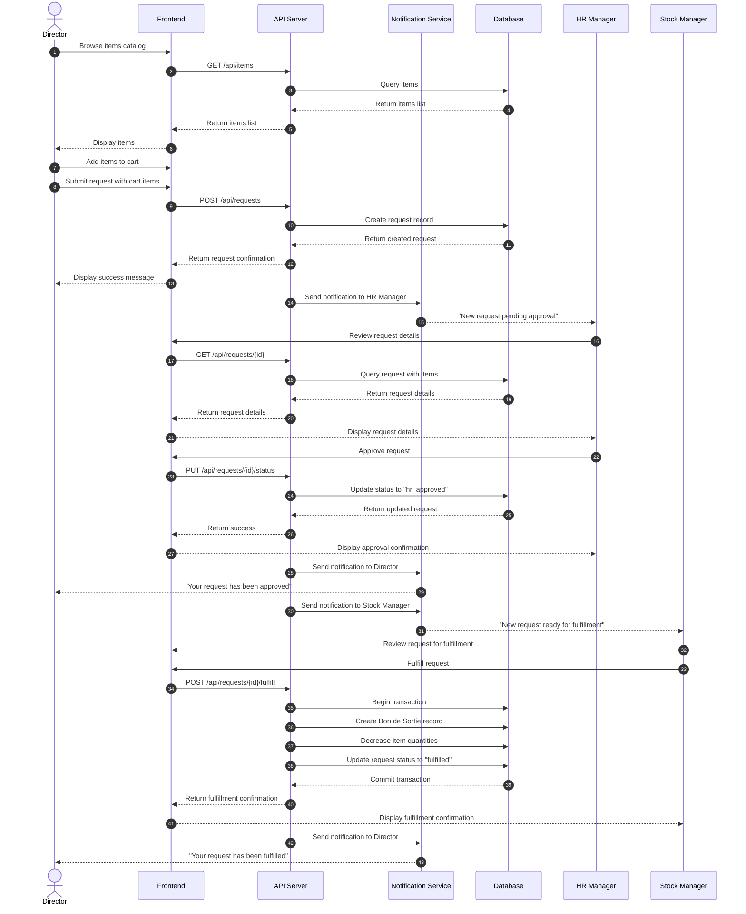
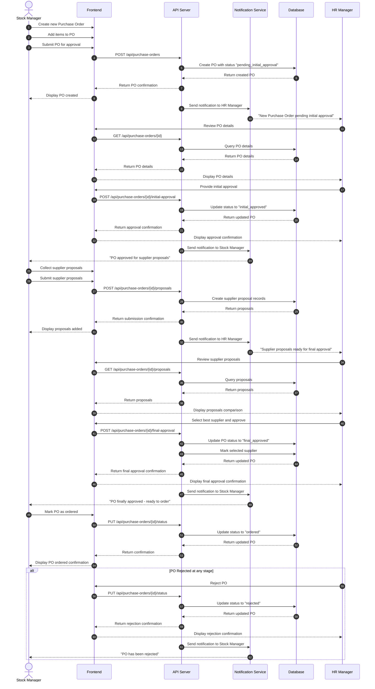
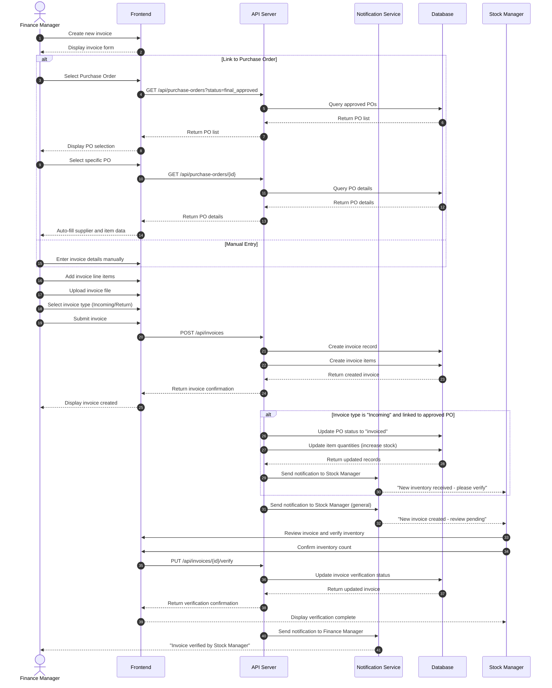

# School Inventory Management System - UML Diagrams

This document contains the UML diagrams for the School Inventory Management System (Complexe Scolaire AL AMINE).

---

## 1. Use Case Diagram

```mermaid
usecaseDiagram
    left to right direction
    
    actor "👤 Director" as director
    actor "📦 Stock Manager" as stock_manager
    actor "👔 HR Manager" as hr_manager
    actor "💰 Finance Manager" as finance_manager
    
    actor "🔔 Notification System" as notification_system
    
    rectangle Authentication {
        usecase "UC1: Login" as UC1
        usecase "UC2: Logout" as UC2
        usecase "UC3: View Profile" as UC3
    }
    
    rectangle Items {
        usecase "UC4: Browse Items" as UC4
        usecase "UC5: Create Item" as UC5
        usecase "UC6: Update Item" as UC6
        usecase "UC7: Delete Item" as UC7
        usecase "UC8: View Item Details" as UC8
        usecase "UC9: Set Low Stock Alert" as UC9
    }
    
    rectangle Requests {
        usecase "UC10: Create Request" as UC10
        usecase "UC11: View My Requests" as UC11
        usecase "UC12: Add Items to Cart" as UC12
        usecase "UC13: Submit Request" as UC13
        usecase "UC14: Cancel Request" as UC14
    }
    
    rectangle Approvals {
        usecase "UC15: Approve Request" as UC15
        usecase "UC16: Reject Request" as UC16
        usecase "UC17: Fulfill Request" as UC17
    }
    
    rectangle PurchaseOrders {
        usecase "UC18: Create Purchase Order" as UC18
        usecase "UC19: Add PO Items" as UC19
        usecase "UC20: Submit Supplier Proposals" as UC20
        usecase "UC21: Initial Approval" as UC21
        usecase "UC22: Final Approval" as UC22
        usecase "UC23: Mark as Ordered" as UC23
        usecase "UC24: Reject PO" as UC24
    }
    
    rectangle Invoices {
        usecase "UC25: Create Invoice" as UC25
        usecase "UC26: Link Invoice to PO" as UC26
        usecase "UC27: Update Inventory from Invoice" as UC27
        usecase "UC28: View Invoice" as UC28
        usecase "UC29: Delete Invoice" as UC29
    }
    
    rectangle Reports {
        usecase "UC30: View Dashboard" as UC30
        usecase "UC31: View Consumption Stats" as UC31
        usecase "UC32: View Spending Stats" as UC32
        usecase "UC33: Export Consumed Materials" as UC33
        usecase "UC34: Export Department Consumption" as UC34
        usecase "UC35: View Low Stock Alerts" as UC35
    }
    
    rectangle BonDeSortie {
        usecase "UC36: View Bon de Sortie" as UC36
        usecase "UC37: Generate Bon de Sortie" as UC37
    }
    
    notification_system -- UC1
    notification_system -- UC15
    notification_system -- UC16
    notification_system -- UC17
    notification_system -- UC21
    notification_system -- UC22
    notification_system -- UC24
    notification_system -- UC35
    
    director --> UC1
    director --> UC2
    director --> UC3
    director --> UC4
    director --> UC8
    director --> UC10
    director --> UC11
    director --> UC12
    director --> UC13
    director --> UC14
    director --> UC30
    director --> UC31
    director --> UC35
    
    stock_manager --> UC1
    stock_manager --> UC2
    stock_manager --> UC3
    stock_manager --> UC4
    stock_manager --> UC5
    stock_manager --> UC6
    stock_manager --> UC7
    stock_manager --> UC8
    stock_manager --> UC9
    stock_manager --> UC15
    stock_manager --> UC16
    stock_manager --> UC17
    stock_manager --> UC18
    stock_manager --> UC19
    stock_manager --> UC20
    stock_manager --> UC23
    stock_manager --> UC24
    stock_manager --> UC30
    stock_manager --> UC31
    stock_manager --> UC32
    stock_manager --> UC33
    stock_manager --> UC35
    stock_manager --> UC36
    stock_manager --> UC37
    
    hr_manager --> UC1
    hr_manager --> UC2
    hr_manager --> UC3
    hr_manager --> UC4
    hr_manager --> UC8
    hr_manager --> UC15
    hr_manager --> UC16
    hr_manager --> UC21
    hr_manager --> UC22
    hr_manager --> UC24
    hr_manager --> UC30
    hr_manager --> UC31
    hr_manager --> UC32
    hr_manager --> UC35
    
    finance_manager --> UC1
    finance_manager --> UC2
    finance_manager --> UC3
    finance_manager --> UC4
    finance_manager --> UC8
    finance_manager --> UC25
    finance_manager --> UC26
    finance_manager --> UC27
    finance_manager --> UC28
    finance_manager --> UC29
    finance_manager --> UC30
    finance_manager --> UC31
    finance_manager --> UC32
    finance_manager --> UC33
    finance_manager --> UC34
    finance_manager --> UC35
```

---

## 2. Activity Diagrams

### 2.1 Request Workflow

```mermaid
activity
    start
    :Director logs in;
    :Director browses available items;
    :Director adds items to cart;
    :Director submits request;
    
    note right: System sends notification to HR Manager
    
    :HR Manager reviews request;
    
    if (Request valid?) then (Yes)
        :HR Manager approves request;
        
        note right: System sends notification to Director
        note right: System sends notification to Stock Manager
        
        :Stock Manager checks stock availability;
        
        if (Sufficient stock?) then (Yes)
            :Stock Manager fulfills request;
            
            note right: System auto-generates Bon de Sortie
            note right: System decreases item stock
            note right: System sends notification to Director
            
            :Request marked as fulfilled;
            stop
        else (No)
            :Stock Manager creates Purchase Order;
            
            note right: System sends notification to HR Manager
            
            :HR Manager approves PO;
            :PO sent to suppliers;
            :Stock received;
            :Request fulfilled;
            
            note right: System sends notification to Director
            
            :Request marked as fulfilled;
            stop
        endif
    else (No)
        :HR Manager rejects request;
        
        note right: System sends notification to Director
        
        :Request marked as rejected;
        stop
    endif
```

### 2.2 Purchase Order Workflow

```mermaid
activity
    start
    :Stock Manager creates Purchase Order;
    :Stock Manager adds items to PO;
    
    note right: System sets status to "pending_initial_approval"
    note right: System sends notification to HR Manager
    
    :HR Manager reviews PO;
    
    if (PO meets criteria?) then (Yes)
        :HR Manager provides initial approval;
        
        note right: System sets status to "initial_approved"
        note right: System sends notification to Stock Manager
        
        :Stock Manager collects supplier proposals;
        :Stock Manager submits proposals;
        
        note right: System sets status to "pending_final_approval"
        note right: System sends notification to HR Manager
        
        :HR Manager reviews proposals;
        
        if (Best supplier selected?) then (Yes)
            :HR Manager provides final approval;
            
            note right: System sets status to "final_approved"
            note right: System sends notification to Stock Manager
            
            :Stock Manager marks PO as ordered;
            
            note right: System sets status to "ordered"
            
            :PO completed;
            stop
        else (No)
            :HR Manager rejects PO;
            
            note right: System sends notification to Stock Manager
            note right: System sets status to "rejected"
            
            stop
        endif
    else (No)
        :HR Manager rejects PO;
        
        note right: System sends notification to Stock Manager
        note right: System sets status to "rejected"
        
        stop
    endif
```

### 2.3 Invoice Workflow

```mermaid
activity
    start
    :Finance Manager creates invoice;
    
    if (Link to Purchase Order?) then (Yes)
        :Finance Manager selects PO;
        
        note right: System validates PO exists and is approved
        note right: System auto-fills supplier and item details
    else (No)
        :Finance Manager manually enters details;
    endif
    
    :Finance Manager adds invoice items;
    :Finance Manager uploads invoice file;
    
    if (Invoice type is "Incoming") then (Yes)
        :Finance Manager confirms inventory update;
        
        note right: System auto-increases item stock
        
        if (Link to approved PO?) then (Yes)
            :System marks PO as "invoiced";
        else (No)
        endif
    else (No - Return)
        :System records return;
    endif
    
    :Invoice saved;
    
    note right: System sends notification to Stock Manager for verification
    
    stop
```

### 2.4 Bon de Sortie (Release Slip) Workflow

```mermaid
activity
    start
    :Request status changes to "hr_approved";
    
    fork
        :Stock Manager accesses fulfillment screen;
    fork again
        :System auto-generates Bon de Sortie record;
        
        note right: Status set to "pending_stock_approval"
    end fork
    
    :Stock Manager reviews requested items;
    
    if (All items available?) then (Yes)
        :Stock Manager confirms fulfillment;
        
        note right: System sets Bon de Sortie status to "approved"
        
        :System decreases item quantities;
        
        note right: System updates stock levels
        
        :System marks request as "fulfilled";
        
        note right: System sends notification to Director
        
        stop
    else (Partial)
        :Stock Manager notes partial fulfillment;
        :System creates partial Bon de Sortie;
        
        note right: System sends notification to Director explaining partial fulfillment
        
        :Director acknowledges;
        
        :System creates Purchase Order for missing items;
        
        note right: System sends notification to HR Manager
        
        stop
    else (No - None available)
        :Stock Manager cancels fulfillment;
        :System marks items as "out of stock";
        
        note right: System sends notification to Director
        
        :Director creates new request later;
        stop
    endif
```

---

## 3. Sequence Diagrams

### 3.1 Request Creation and Fulfillment Sequence



### 3.2 Purchase Order Lifecycle Sequence



### 3.3 Invoice Creation Sequence



---

## Appendix: Legend

### Symbols Used

| Symbol | Meaning |
|--------|---------|
| → | Synchronous message/call |
| →→ | Asynchronous message |
| -->> | Response/return |
| alt/else | Alternative paths |
| loop | Repetition |
| fork | Parallel processing |
| note | Additional information |

### Status Values

**Request Status:** `pending` → `hr_approved` → `fulfilled` or `rejected`

**Purchase Order Status:** `pending_initial_approval` → `initial_approved` → `pending_final_approval` → `final_approved` → `ordered` or `rejected`

**Invoice Types:** `incoming`, `return`

### Actor Summary

| Actor | Primary Responsibilities |
|-------|------------------------|
| Director | Create requests, browse items, view fulfillment status |
| Stock Manager | Manage items, fulfill requests, create POs, manage stock |
| HR Manager | Approve requests and POs, system oversight |
| Finance Manager | Manage invoices, generate financial reports |

---

*Generated for Complexe Scolaire AL AMINE - School Inventory Management System*
