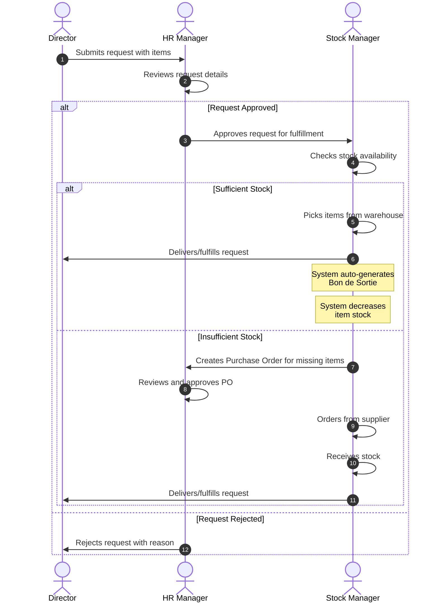
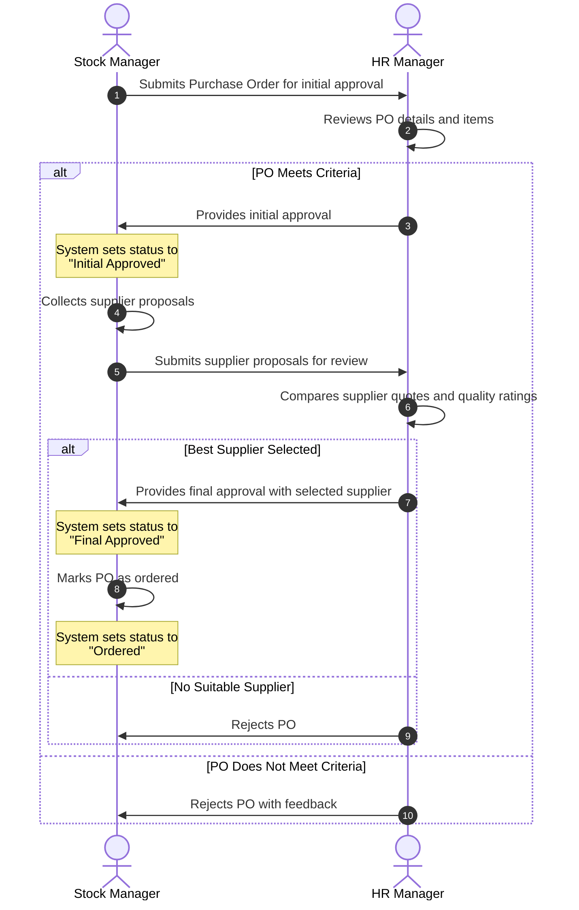
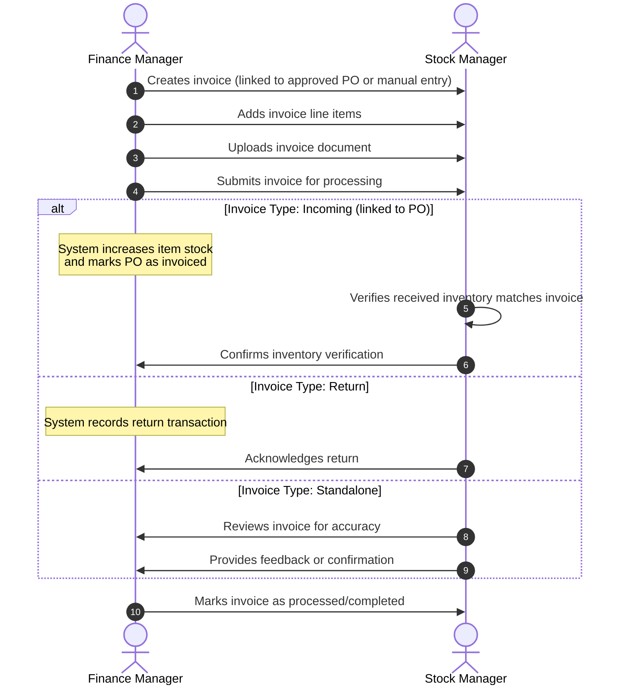
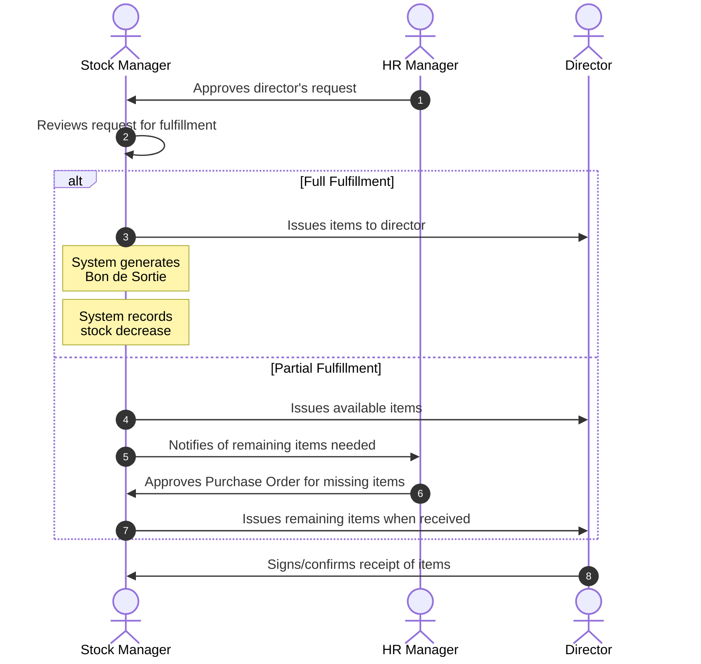

# Sequence Diagrams - School Inventory Management System

This document contains actor-focused sequence diagrams showing the flow of actions between users in the School Inventory Management System.

---

## 1. Request Creation and Fulfillment



---

## 2. Purchase Order Lifecycle



---

## 3. Invoice Management



---

## 4. Bon de Sortie Generation (Triggered by Request Fulfillment)



---

## Appendix: Actor Responsibilities Summary

| Actor | Role in Workflows |
|-------|------------------|
| **Director** | Initiates requests, receives fulfilled items |
| **HR Manager** | Reviews and approves requests, approves purchase orders |
| **Stock Manager** | Manages inventory, fulfills requests, creates POs, verifies received stock |
| **Finance Manager** | Creates and manages invoices, links to POs |

---

## Status Flow Reference

### Request Status
```
Pending → HR Approved → Fulfilled
    ↓
  Rejected
```

### Purchase Order Status
```
Pending Initial Approval → Initial Approved → Pending Final Approval → Final Approved → Ordered
         ↓                                                    ↓
       Rejected                                          Rejected
```

---

*Generated for Complexe Scolaire AL AMINE - School Inventory Management System*
